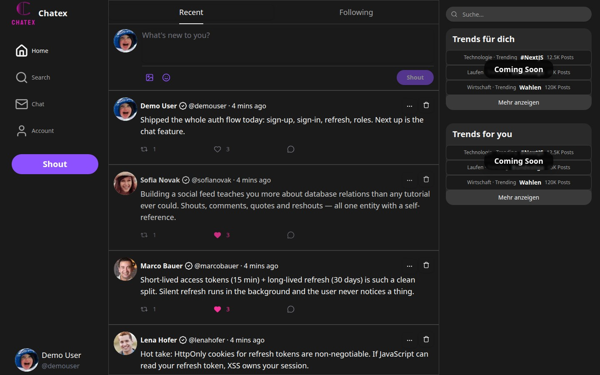
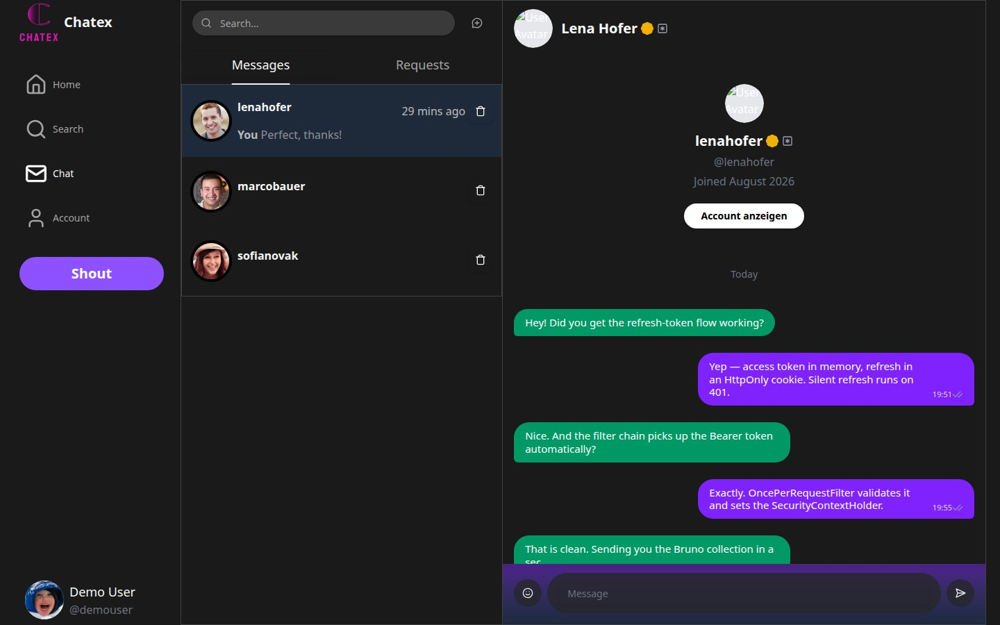
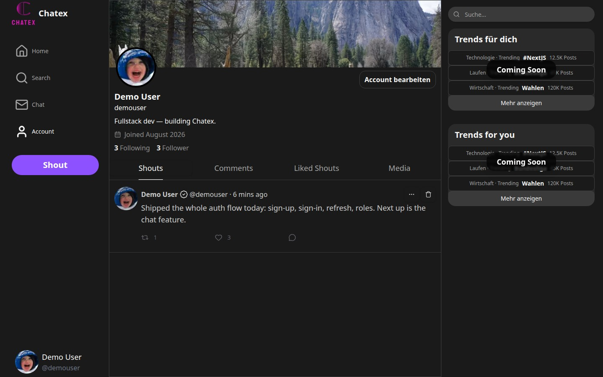
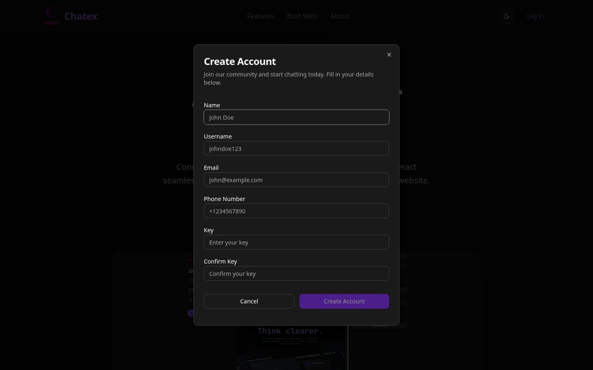

# Chatex

A real-time chat application built with **Next.js** (frontend) and **Spring Boot** (backend), featuring a complete authentication system with JWT-based access and refresh tokens.

## Screenshots

<div align="center">
  
  <br/>
  <sub><b>Landing</b> — the entry point, with sign-up and sign-in.</sub>
</div>

<table>
<tr>
<td width="50%" valign="top">
  
  <sub><b>Feed</b> — shouts with likes, reshouts and comments.</sub>
</td>
<td width="50%" valign="top">
  
  <sub><b>Chat</b> — direct messages over WebSocket, with seen state.</sub>
</td>
</tr>
<tr>
<td width="50%" valign="top">
  
  <sub><b>Profile</b> — avatar, banner, bio, followers and the user's own shouts.</sub>
</td>
<td width="50%" valign="top">
  
  <sub><b>Sign-up</b> — posts to <code>/api/v1/auth/sign-up</code>.</sub>
</td>
</tr>
</table>

## Tech Stack

| Layer    | Technology                          |
|----------|-------------------------------------|
| Frontend | Next.js, TypeScript, Tailwind CSS, Redux, Axios |
| Backend  | Spring Boot, Spring Security, JPA/Hibernate     |
| Auth     | JWT (Access + Refresh tokens), HS256 signing     |
| Database | P-SQL (via Docker Compose)                  |

## Project Structure

```
chatex/
├── frontend/          # Next.js application
├── backend/           # Spring Boot application
└── docker-compose.yml # Database & infrastructure
```

## Authentication Architecture

The authentication layer supports **user registration** and **sign-in**, issuing a short-lived **access token** (15 min) in the response body and a long-lived **refresh token** (30 days) as an HttpOnly cookie. A dedicated refresh endpoint allows the client to obtain a new access token without re-authenticating.

### Key Design Decisions

- **Access token** → sent in the JSON response body, stored client-side, attached via `Authorization: Bearer` header.
- **Refresh token** → set as an `HttpOnly` cookie (`refresh_jwt`), not accessible to JavaScript — mitigating XSS-based token theft.
- **Password hashing** → Spring Security's `DelegatingPasswordEncoder` (bcrypt by default).
- **Identity field** → `username` (unique), with additional uniqueness constraints on `email` and `phone`.
- **Token claims** → each JWT contains a `type_jwt` claim (`ACCESS` or `REFRESH`) to distinguish token types.
- **Signing** → HMAC-SHA256 with a shared secret key.

### Authentication Flow

```mermaid
sequenceDiagram
    autonumber
    participant Client as 📱 Frontend (Axios)
    participant Ctrl as AuthController
    participant USvc as UserService
    participant ASvc as AuthenticationService
    participant Mgr as AuthenticationManager
    participant JwtSvc as JwtService
    participant UDS as CustomUserDetailsService
    participant DB as 💾 Database

    %% ═══════════════════════════════════════
    %% SIGN-UP FLOW
    %% ═══════════════════════════════════════
    rect rgb(220, 245, 220)
        Note over Client, DB: 🔐 Sign-Up Flow — POST /api/v1/auth/sign-up

        Client ->> Ctrl: POST /api/v1/auth/sign-up<br/>(name, username, email, phone, key)
        Ctrl ->> USvc: createAccount(SignUpAccountRequestDto)

        Note over USvc, DB: Uniqueness Validation
        USvc ->> DB: existsUserByUsername(username)
        DB -->> USvc: false ✅
        USvc ->> DB: existsUserByEmail(email)
        DB -->> USvc: false ✅
        USvc ->> DB: existsUserByPhone(phone)
        DB -->> USvc: false ✅

        alt Username / Email / Phone already exists
            USvc -->> Ctrl: throw EntityExistsException
            Ctrl -->> Client: 409 Conflict (User already exists)
        else All fields unique
            Note right of USvc: passwordEncoder.encode(key)
            USvc ->> DB: save(User Entity)
            DB -->> USvc: Saved User (with UUID)
            USvc -->> Ctrl: User Entity

            Note over Ctrl, JwtSvc: Token Generation
            Ctrl ->> JwtSvc: createAccessTk(username, ACCESS)
            Note right of JwtSvc: JWT signed with HS256<br/>Expiry: 15 minutes<br/>Claim: type_jwt = ACCESS
            JwtSvc -->> Ctrl: Access JWT String

            Ctrl ->> JwtSvc: createRefreshTk(username, REFRESH)
            Note right of JwtSvc: JWT signed with HS256<br/>Expiry: 30 days<br/>Claim: type_jwt = REFRESH
            JwtSvc -->> Ctrl: Refresh JWT String

            Note over Ctrl: Set refresh_jwt as HttpOnly Cookie<br/>(Path=/, MaxAge=30 days, Secure=false)

            Ctrl -->> Client: 201 Created<br/>Body: { accessJwt, expiresIn: 900 }<br/>Cookie: refresh_jwt=<token>
        end
    end

    %% ═══════════════════════════════════════
    %% SIGN-IN FLOW
    %% ═══════════════════════════════════════
    rect rgb(220, 230, 255)
        Note over Client, DB: 🔑 Sign-In Flow — POST /api/v1/auth/sign-in

        Client ->> Ctrl: POST /api/v1/auth/sign-in<br/>(username, key)
        Ctrl ->> ASvc: authenticate(username, key)

        Note over ASvc, Mgr: Credential Validation via Spring Security
        ASvc ->> Mgr: authenticate(UsernamePasswordAuthenticationToken)

        Note over Mgr, UDS: The "Contract" Call
        Mgr ->> UDS: loadUserByUsername(username)
        UDS ->> DB: findByUsername(username)
        DB -->> UDS: User Entity
        UDS -->> Mgr: CustomUserDetails (w/ hashed key)

        Note right of Mgr: passwordEncoder.matches(rawKey, hashedKey)

        alt Credentials Invalid
            Mgr -->> ASvc: throw BadCredentialsException
            ASvc -->> Ctrl: Exception
            Ctrl -->> Client: 401 Unauthorized
        else Credentials Valid
            Mgr -->> ASvc: Authentication Success ✅

            Note over ASvc, UDS: Reload UserDetails
            ASvc ->> UDS: loadUserByUsername(username)
            UDS -->> ASvc: CustomUserDetails

            ASvc -->> Ctrl: UserDetails

            Note over Ctrl, JwtSvc: Token Generation (same as Sign-Up)
            Ctrl ->> JwtSvc: createAccessTk(username, ACCESS)
            JwtSvc -->> Ctrl: Access JWT (15 min)
            Ctrl ->> JwtSvc: createRefreshTk(username, REFRESH)
            JwtSvc -->> Ctrl: Refresh JWT (30 days)

            Note over Ctrl: Set refresh_jwt as HttpOnly Cookie

            Ctrl -->> Client: 200 OK<br/>Body: { accessJwt, expiresIn: 900 }<br/>Cookie: refresh_jwt=<token>
        end
    end

    %% ═══════════════════════════════════════
    %% TOKEN REFRESH FLOW
    %% ═══════════════════════════════════════
    rect rgb(255, 245, 220)
        Note over Client, DB: 🔄 Token Refresh — GET /api/v1/auth/access-jwt

        Client ->> Ctrl: GET /api/v1/auth/access-jwt<br/>Cookie: refresh_jwt=<token>
        Ctrl ->> JwtSvc: extractRefreshTk(request)
        Note right of JwtSvc: Read "refresh_jwt" from cookies

        alt Refresh token missing or empty
            JwtSvc -->> Ctrl: null
            Ctrl -->> Client: 401 Unauthorized<br/>"The refresh token is missing"
        else Refresh token present
            JwtSvc -->> Ctrl: Refresh JWT String
            Ctrl ->> JwtSvc: validateTk(refreshTk)

            Note over JwtSvc, UDS: Parse JWT → extract username
            JwtSvc ->> UDS: loadUserByUsername(username)
            UDS ->> DB: findByUsername(username)
            DB -->> UDS: User Entity
            UDS -->> JwtSvc: CustomUserDetails ✅
            JwtSvc -->> Ctrl: UserDetails

            Ctrl ->> JwtSvc: createAccessTk(username, ACCESS)
            JwtSvc -->> Ctrl: New Access JWT (15 min)
            Note right of Ctrl: No new refresh cookie issued

            Ctrl -->> Client: 200 OK<br/>Body: { accessJwt, expiresIn: 900 }
        end
    end

    %% ═══════════════════════════════════════
    %% SUBSEQUENT AUTHENTICATED REQUESTS
    %% ═══════════════════════════════════════
    rect rgb(245, 230, 245)
        Note over Client, DB: 🛡️ Subsequent Requests — JwtAuthenticationFilter

        Client ->> Client: Store accessJwt in memory/localStorage
        Client ->> Ctrl: Any API Request<br/>Header: Authorization: Bearer <accessJwt>

        Note over Ctrl, JwtSvc: JwtAuthenticationFilter (OncePerRequestFilter)
        Ctrl ->> JwtSvc: extractAccesTk(request)
        Note right of JwtSvc: Parse "Authorization: Bearer ..." header

        alt No token in header
            Note over Ctrl: No authentication set → proceed as anonymous
        else Token present
            JwtSvc -->> Ctrl: Access JWT String
            Ctrl ->> JwtSvc: validateTk(accessTk)
            JwtSvc ->> UDS: loadUserByUsername(username)
            UDS ->> DB: findByUsername(username)
            DB -->> UDS: User Entity
            UDS -->> JwtSvc: CustomUserDetails
            JwtSvc -->> Ctrl: UserDetails ✅

            Note over Ctrl: Set SecurityContext:<br/>UsernamePasswordAuthenticationToken<br/>+ request.setAttribute("userId", UUID)
        end

        Ctrl ->> DB: Proceed to downstream controller<br/>(Authenticated context available)
    end
```



### API Endpoints

| Method | Endpoint                   | Description                              | Auth Required |
|--------|----------------------------|------------------------------------------|---------------|
| POST   | `/api/v1/auth/sign-up`     | Register a new account                   | No            |
| POST   | `/api/v1/auth/sign-in`     | Sign in with username & key              | No            |
| GET    | `/api/v1/auth/access-jwt`  | Get a new access token via refresh cookie| Refresh Cookie|

### Token Lifecycle

```
Sign-Up / Sign-In
       │
       ├──► Access JWT  (body)   → expires in 15 minutes
       └──► Refresh JWT (cookie) → expires in 30 days
                │
                ▼
        GET /api/v1/auth/access-jwt
                │
                └──► New Access JWT (body) → another 15 minutes
```

## Getting Started

```bash
# Start the database
docker compose up -d

# Run the backend
cd backend && ./mvnw spring-boot:run

# Run the frontend
cd frontend && npm install && npm run dev
```

The frontend runs on `http://localhost:3000` and the backend on `http://localhost:8080`.
